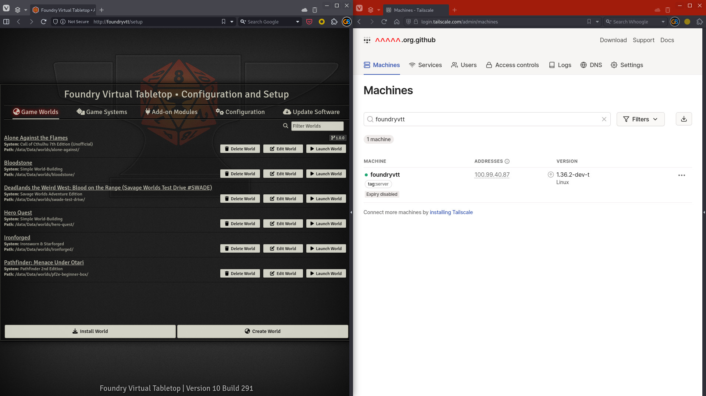

Private FoundryVTT server
=========================


Private Foundry VTT server using caddy-tailscale




Note: you need to have a license key to use FoundryVTT


### Usage

Download and copy the Foundry distribution file to a folder that will be used for the Foundrydata

```
$ mkdir -p ./foundrydata/
# copy file as FoundryVTT*.zip or foundryvtt.zip to ./foundrydata
```

Obtain a Tailscale authentication key from

   https://login.tailscale.com/admin/settings/keys


Depending on your needs, set the expiration of the key, if it tags the node, etc. Make sure the ACL is set to allow access to othe people in your tailnet.

After this you can run the container. Be sure to set the `TS_AUTHKEY` value


```
$ podman run -d \
   --name=foundryvtt \
   -v ./foundrydata:/data \
   --env=TS_AUTHKEY=tskey-auth-... \
   ghcr.io/spotsnel/caddy-tailscale-foundryvtt-server
```

If the node joined your tailnet, it should show up as `foundryvtt` in:

    https://login.tailscale.com/admin/machines

after which you can navigate to:

    http://foundryvtt


and finish the configuration or login.


### Build
To build the `Containefile`, please do:

```
$ podman build -t foundryvtt -f Containerfile .
```

and use `podman run ... foundryvtt` instead.

Note:
You can rebuild the `caddy-tailscale` with the included `Containerfile`. For this you need to modify the `builder` that is used.
